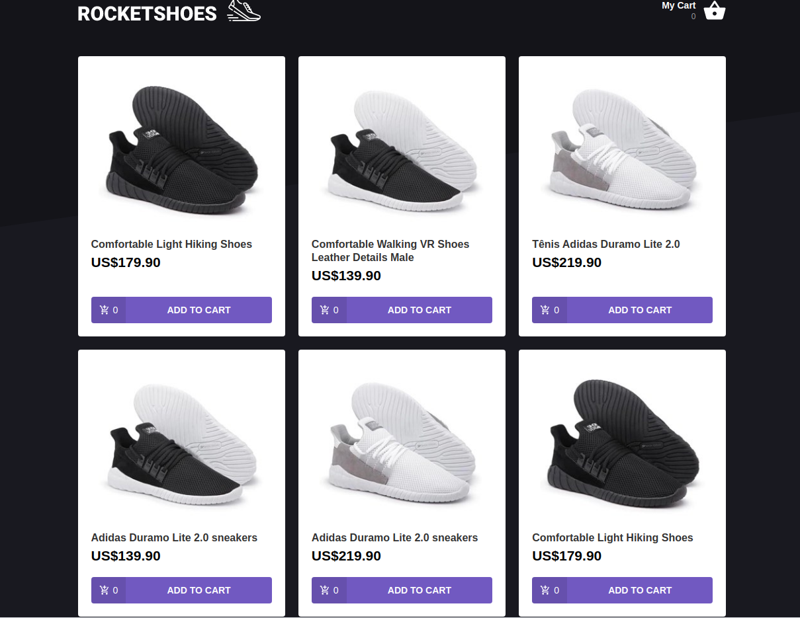
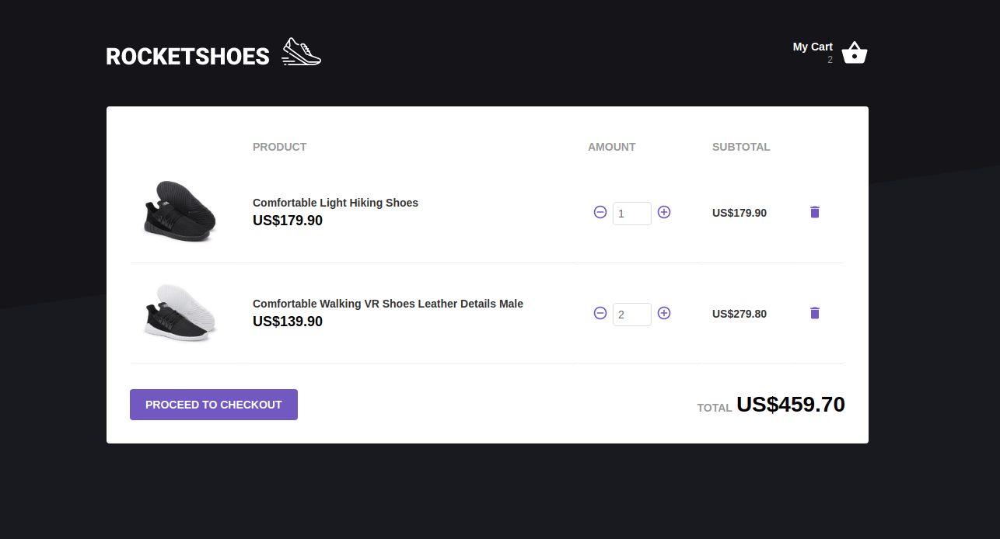

This is a simple shoes e-commerce application where you can see the shoes on sale, add them to cart (the cart also with make the total count) and remove shoes from the cart. 

## Technologies Used
   HTML, CSS Styled Components, Javascript - ReactJS, Redux

In the project directory, you can run:

### `npm install -g json-server`

Install the json-server.

### `yarn install`

Install the dependencies of the project.

### `json-server server.json -p 3333`

Runs the fake api where the application will get the data.

### `yarn start`

Runs the app in the development mode. 
Open [http://localhost:3000](http://localhost:3000) to view it in the browser.

The page will reload if you make edits. 
You will also see any lint errors in the console.
